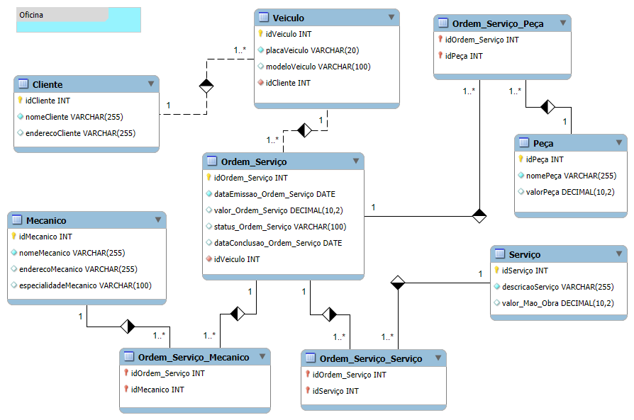

# Construindo um Esquema Conceitual para Banco De dados

O esquema de banco de dados foi projetado para atender às necessidades de uma oficina mecânica, contemplando as relações entre clientes, veículos, ordens de serviço, mecânicos, serviços e peças.

  
  

## Descrição as cardinalidades dos relacionamentos no esquema de banco de dados para a oficina mecânica, detalhando o significado de cada um e a justificativa para sua modelagem.

## 1. Cliente - Veículo (1:N)
Descrição: Um cliente pode possuir múltiplos veículos (carros, motos, ...), mas um veículo específico pertence a um único cliente.
Justificativa: Esta cardinalidade reflete a realidade de que uma pessoa pode ser proprietária de diversos veículos, mas um veículo individual tem apenas um dono.

## 2. Veículo - Ordem de Serviço (1:N)
Descrição: Um veículo pode ter várias ordens de serviço (revisões, reparações, entre outros) ao longo do tempo, mas uma ordem de serviço se refere a um único veículo.
Justificativa: Um veículo pode necessitar de diferentes serviços em momentos distintos, mas cada ordem de serviço é aberta para um veículo específico.

## 3. Mecânico - Ordem de Serviço (N:N)
Descrição: Uma ordem de serviço pode ser atribuída a múltiplos mecânicos (que trabalham em equipa), e um mecânico pode participar de diversas ordens de serviço.
Justificativa: Uma equipa de mecânicos pode trabalhar em um mesmo veículo, e um mecânico pode atender diferentes veículos ao longo do tempo.

## 4. Ordem de Serviço - Serviço (N:N)
Descrição: Uma ordem de serviço pode envolver vários serviços diferentes (troca de óleo, alinhamento, etc.), e um serviço pode ser parte de várias ordens de serviço.
Justificativa: Um veículo pode precisar de múltiplos serviços em uma mesma ordem de serviço, e um serviço específico (como troca de óleo) pode ser realizado em diferentes veículos.

## 5. Ordem de Serviço - Peça (N:N)
Descrição: Uma ordem de serviço pode necessitar de várias peças diferentes (filtros, velas, pneus, etc.), e uma peça pode ser utilizada em várias ordens de serviço.
Justificativa: Um veículo pode precisar de diversas peças em um reparo, e uma peça específica (como um filtro de ar) pode ser utilizada em diferentes veículos.

As tabelas de relacionamento Ordem_Serviço_Mecanico, Ordem_Serviço_Serviço e Ordem_Serviço_Peça são consideradas entidades fracas dado que estas tabelas não possuem uma chave primária própria, mas sim uma chave primária composta pelas chaves estrangeiras que referenciam as tabelas relacionadas. Ou seja, a combinação das chaves estrangeiras (idOrdem_Serviço, idMecanico, idServiço e idPeça) é que identifica unicamente cada registro nessas tabelas.

Exemplo: A tabela Ordem_Serviço_Mecanico não existiria se não existissem as ordens de serviço e os mecânicos. Ela serve apenas para registar a relação entre eles, indicando quais mecânicos estão trabalhando em quais ordens de serviço.

